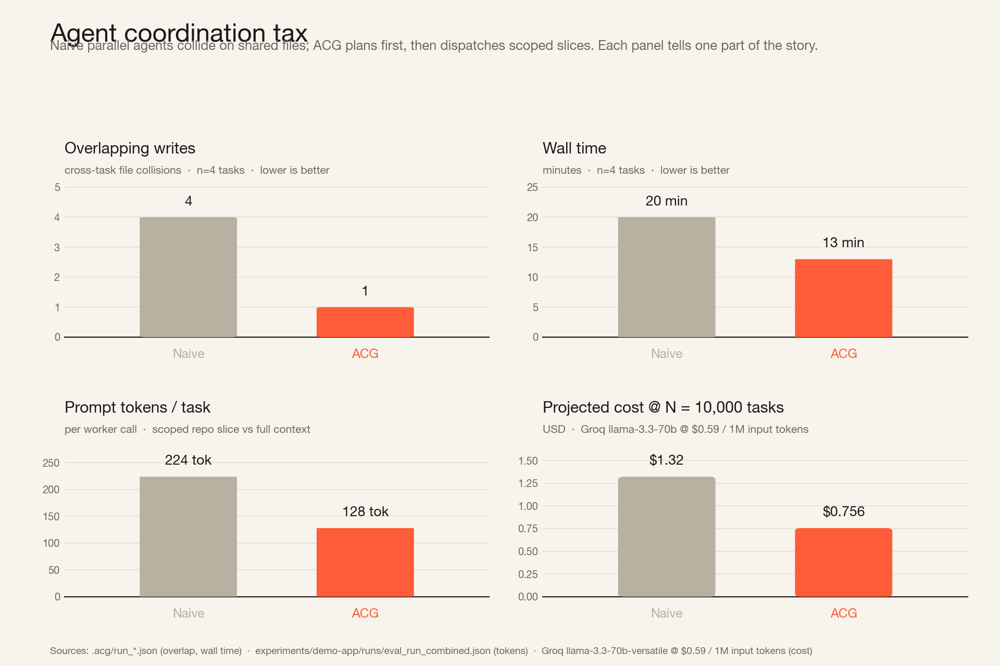

# Agent Context Graph (ACG)

> **It's `package-lock.json` for parallel coding agents.**

Multi-agent coding systems today coordinate at the wrong stage — they let workers edit in parallel and absorb the cost of overlapping file modifications through merge tools, manual intervention, and trial-and-error convergence. **Agent Context Graph (ACG) introduces write contracts as a compileable primitive.** By moving conflict detection to a static pre-execution phase, ACG compiles natural language task lists and repository context into a committable, human-reviewable `agent_lock.json` contract. This lockfile restricts each agent's filesystem write authority via strict boundaries (`allowed_paths`), sequences contending tasks into parallel-safe execution groups, and provides a continuous validation substrate that audits proposed edits mid-flight or post-hoc from pull requests.

## Live execution mode

ACG ships with a runtime (`acg/runtime.py`) that executes a lockfile against two local LLM server instances:

- **Orchestrator** (port 8081) — thinks aloud about the dispatch plan
- **Sub-agents** (port 8080) — propose write-sets per task, no thinking

Each worker's proposed writes are validated against its task's `allowed_paths` via `validate_write()`. Both ALLOWED and BLOCKED proposals are recorded to `demo-app/.acg/run_trace.json`. The visualizer replays the trace in real time:

```bash
make compile-gemma   # build the lockfile against live local server
make run-gemma       # execute it; ~30s, writes run_trace.json
make viz             # open the live-replay visualizer
```

Offline / CI mode uses a deterministic mock:

```bash
make run-mock && make viz
```

See `viz/README.md` for the visualizer architecture and `acg/runtime.py` for the runtime's prompt construction and validation pipeline. Full multi-codebase evaluation results are available in [`papers/GREENHOUSE_RESULTS.md`](papers/GREENHOUSE_RESULTS.md).

## Architecture

ACG operates as a rigorous three-step compiler pipeline transforming repository goals into static write-boundary guarantees:

```text
tasks.json + repo  ──► Step 1: Repo Graph Construction   ──► context_graph.json
                                  │
                                  ▼
                       Step 2: Write-Set Predictor       ──► PredictedWrite[]
                                  │
                                  ▼
                       Step 3: DAG Solver                ──► execution_plan
                                  │
                                  ▼
                           agent_lock.json
                                  │
            ┌─────────────────────┴─────────────────────┐
            ▼                                           ▼
     Scoped Workers                             Write Validator
```

1. **Repository Graph Construction**: Scans the target codebase using dedicated parsers (`ts-morph` for TypeScript/JavaScript, native AST for Python, `tree-sitter` for Java) to build a robust file-level dependency and co-change graph.
2. **Write-Set Predictor**: Expands lightweight multi-seed heuristics (regex patterns, symbol references, index hits) via LLM re-ranking to emit high-confidence predicted write targets for each individual task.
3. **DAG Solver**: Analyzes cross-task contention on predicted write targets to construct a dependency graph. Tasks with disjoint write-sets are assigned to parallel execution groups, while contending tasks are serialized deterministically. The resulting execution schedule and file permissions are codified into `agent_lock.json`.

During runtime execution, scoped workers receive focused context tailored to their task boundaries, and every proposed edit passes through a write validator to block unauthorized repository access. Long form architectural details are in [`docs/ARCHITECTURE.md`](docs/ARCHITECTURE.md).

## Empirical Results

Evaluated extensively across 6 repositories and 3 model families per the ASE NIER 2026 paper, ACG demonstrates substantial improvements in safety and efficiency:

- **Prompt-Token Reduction**: Achieves **9.7% to 56%** reduction in per-worker prompt tokens by delivering tightly scoped context windows instead of complete repository maps.
- **Productivity Lift**: Significantly improves Commits-per-Prompt (CuPP) efficiency by eliminating parallel agent collisions and expensive post-hoc manual merge cycles.
- **Write-Boundary Safety**: Guarantees **zero non-target modifications** for ACG-planned tasks across extensive baseline testing. Under negative-control testing with tightened scopes, unauthorized write attempts are deterministically intercepted and blocked by the validator.

## Demo



Same 4 tasks (`oauth`, `billing`, `settings`, `tests`) on the same `demo-app`, comparing two strategies:

| Metric               | Naive parallel | ACG-planned |
| -------------------- | -------------- | ----------- |
| Overlapping writes   | 4              | 1           |
| Blocked bad writes   | 0              | 2           |
| Manual merge steps   | 4              | 0           |
| Tests pass first run | no             | yes         |
| Wall time (min)      | 20             | 13          |

The `oauth` and `settings` tasks are write-disjoint — ACG runs them safely in parallel.
`billing` overlaps with both (`prisma/schema.prisma` with `oauth`, `src/components/Sidebar.tsx` with `settings`) — ACG serializes it after group 1.
`tests` waits for all prior tasks to complete to target the converged final state.

## 60-second quickstart

```bash
git clone <this repo>
cd cognition

make install           # creates .venv, pip installs ACG, npm installs ts-morph
cp .env.example .env   # put your API key in ACG_LLM_API_KEY (or leave blank for offline mock)

make demo              # scan + compile + benchmark + chart in one shot
```

`make demo` produces:

- `demo-app/.acg/context_graph.json` — repo graph (16 files, 3 hotspots)
- `demo-app/agent_lock.json` — committable plan (4 tasks, 3 groups, 2 conflicts)
- `.acg/run_naive.json` + `.acg/run_acg.json` — benchmark metrics
- `docs/benchmark.png` — the comparison chart shown above

To watch the enforcement layer block an out-of-bounds write proposal:

```bash
./.venv/bin/acg validate-write \
  --lock demo-app/agent_lock.json \
  --task settings \
  --path src/server/auth/config.ts
# BLOCKED: path 'src/server/auth/config.ts' is outside task 'settings''s allowed_paths
# exit code 2
```

## What is `agent_lock.json`?

A committable, human-reviewable, schema-validated artifact that declares for each task:

- `prompt` — the natural-language task description
- `predicted_writes[]` — high-confidence files defining the hard write scope
- `allowed_paths[]` — derived file globs strictly enforced by the validator
- `candidate_context_paths[]` — broader localization references exposed as context
- `file_scopes[]` — tiered localization tracking records
- `depends_on[]` — explicit upstream tasks
- `parallel_group` — which DAG execution tier this task belongs to

…plus an `execution_plan.groups[]` array ordering tasks into parallel-safe and serial groups, and a `conflicts_detected[]` array documenting cross-task overlaps. See `examples/lockfile.dag.example.json` for a complete example and `schema/agent_lock.schema.json` for the JSON Schema.

## CLI surface

```text
acg plan-tasks       --repo PATH --goal TEXT --out tasks.json
acg compile          --repo PATH --tasks FILE --out FILE
acg explain          --lock FILE
acg validate-write   --lock FILE --task ID --path PATH
acg validate-diff    --lock FILE --repo PATH --task ID [--base-ref REF] [--head-ref REF]
acg report           --naive FILE --planned FILE --out FILE
acg run-benchmark    --mode {naive,planned} --repo PATH --tasks FILE --out FILE
acg mcp              [--transport stdio]    # MCP server (requires .[mcp] extra)
```

`plan-tasks` decomposes high-level repository goals into reviewable task structures prior to compilation. `validate-diff` audits modified files in a `git diff` against per-task contracts to score real applied patches alongside proposal-only runtime traces.

## Integrations

- **Cognition (Devin)** — ACG provides pre-flight static contracts that a coordinator agent can consume prior to fanning out child workers. See [`docs/COGNITION_INTEGRATION.md`](docs/COGNITION_INTEGRATION.md).
- **Claude Code Integration** — ACG integrates with Claude Code project hooks via `.claude/settings.json` and `scripts/claude_precheck_write.py`, validating `Write` and `Edit` tool calls before they land. See [`docs/CLAUDE_CODE_INTEGRATION.md`](docs/CLAUDE_CODE_INTEGRATION.md).
- **Cascade Integration** — ACG integrates seamlessly via Windsurf Cascade `pre_write_code` and `post_write_code` hook scripts (`.windsurf/hooks.json`). The pre-hook validates file edits inline, blocking out-of-bounds modifications instantly with clear user interface feedback. See [`docs/CASCADE_INTEGRATION.md`](docs/CASCADE_INTEGRATION.md).
- **Model Context Protocol (MCP)** — Core ACG primitives are fully exposed as standard MCP tools. Compatible with leading agent frameworks. See [`docs/MCP_SERVER.md`](docs/MCP_SERVER.md).

## Limitations and Future Work

- **File-Level Granularity**: Write boundaries are enforced at the file level today. Mitigating semantic drift across disjoint files or performing import/export risk analysis represents an exciting direction for future research.
- **Language Coverage**: Production parsers and write-set heuristics currently support Java, TypeScript/JavaScript, and Python. Extending to additional languages requires writing modular graph scanners.
- **Runtime Synchronization**: ACG focuses exclusively on pre-flight static scheduling and contract compilation, operating as a clean upstream complement to runtime synchronization layers (e.g., CodeCRDT).
- **Sample Size Focus**: Current benchmarks provide strong directional indicators across representative codebases; expanding to large-scale, automated multi-trial evaluation suites is ongoing.

## License

MIT — see `LICENSE`.

## Team

Shashank · Prajit
